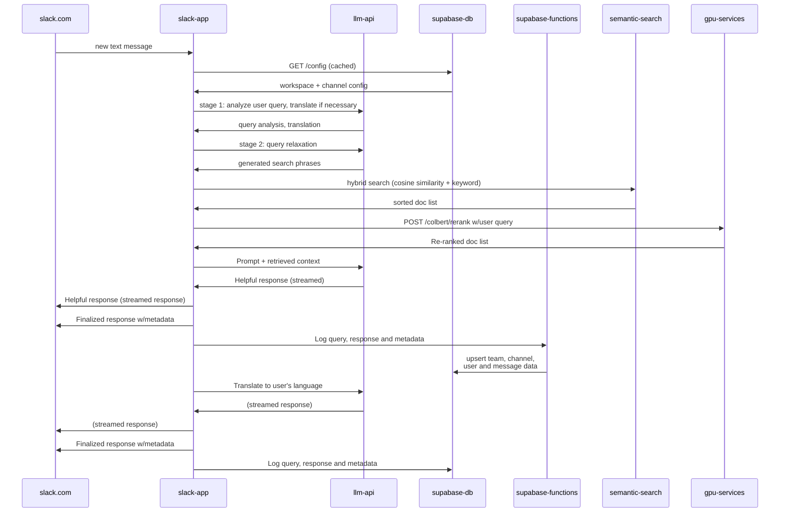

# digdir-assistants

A mono-repo for generative AI assistants, based on RAG architecture. 

Currently deployed as a Slack application, we also plan to integrate with web applications, in particular Altinn Studio.

# Agent flow 

This diagram shows the main functional blocks and how data flows between them:

## See it in action

[#altinn-assistant](https://altinndevops.slack.com/archives/C06JQLHSZME/p1707478070231209)  on Altinn Devops Slack

## Local development quickstart

1. Install dependencies:  

`$ yarn install`

2. Build all packages and apps

`$ yarn build`

3. Run slack-app and admin ui

`$ yarn run:slack-app`

Note: in order for your local bot endpoint to receive traffic from Slack, you need to configure a proxy service such as `ngrok`, and configure a Slack app to use the URL allocated by ngrok.

4. Configure a new Slack app in your test workspace

> It is recommended to create a few Slack workspace specifically for development and testing of Slack apps

## Deploy to Azure Container app

1. Create a resouce group
2. Create a Container App Environment
3. Create a container repository
4. Create a Container App
> For step by step instructions see: [Create a Container App](/documentation/create-a-container-app.md)
   

## Manual job execution

1. Update crawler index

2. Update search phrase index

`$ cd  cli`
`$ yarn run:generate-search-phrases <typesense collection name>`

Example collection name: TEST_altinn-studio-docs-search-phrases`

# System architecture

The Altinn Assistants architecture consists of the following technology components:

1. Front-end (Slack app, Admin web app)
2. Database-as-a-service (Supabase)
3. Serverless function runtime (Supabase Functions)
4. GPU-accelerated (Python app running in a GPU-enabled VM)
5. Text search index (Typesense Cloud)

Sequence diagram showing execution of a typical end user query:

